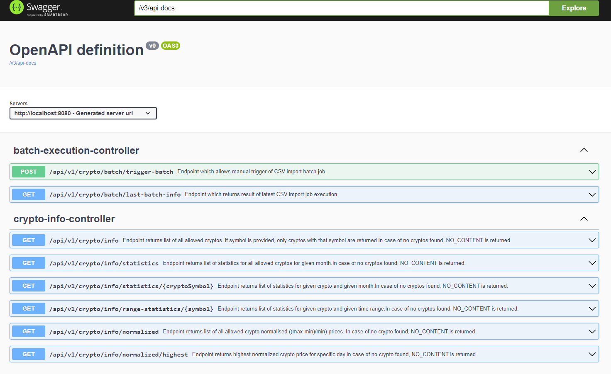

# Crypto advise service

## Plugins Used

This project uses the following Gradle plugins:

### Core Plugins:

- **Java Plugin**: Provides support to compile and test Java source. [More Info](https://docs.gradle.org/current/userguide/java_plugin.html)

- **Spring Boot (`3.1.2`)**: Helps in creating standalone, production-grade Spring-based applications. [More Info](https://spring.io/projects/spring-boot)

- **Spring Dependency Management (`1.1.2`)**: Offers Maven-like dependency management. It centralizes dependency versions in a multi-module project. [More Info](https://spring.io/projects/spring-boot#learn)

### Documentation:

- **Asciidoctor (`3.3.2`)**: Converts AsciiDoc content into HTML, PDF, and other formats. [More Info](https://asciidoctor.org/docs/asciidoctor-gradle-plugin/)

### Deployment:

- **Google Jib (`3.3.1`)**: Builds optimized Docker and OCI images for Java applications without requiring a Docker daemon. [More Info](https://github.com/GoogleContainerTools/jib)
- By running `./gradlew jib` the image will be built and pushed to the docker hub repository, by running `./gradlew jibDockerBuild` the image will be built and stored locally. 
### Code Quality:

- **Lombok (`8.1.0`)**: Reduces boilerplate in Java code like getters, setters, equals, etc. using annotations. [More Info](https://projectlombok.org/)

- **Checkstyle**: Ensures Java code adheres to a coding standard. [More Info](https://checkstyle.sourceforge.io/)

- **PMD**: Source code analyzer that detects common programming flaws. [More Info](https://pmd.github.io/)

- **SpotBugs (`4.7.0`)**: Uses static analysis to identify bugs in Java code. [More Info](https://spotbugs.github.io/)

### Testing:

- **JaCoCo**: A Java Code Coverage tool. [More Info](https://www.jacoco.org/jacoco/trunk/doc/)

## Getting Started

1. Clone the repository.
2. Navigate to the project directory.
3. Run the project using:

```bash
./gradlew bootRun
```

## Configuration Details

The application has several configuration options that are defined in the `application.yml` file. Here's a breakdown:

### Application Configurations:

#### Files:

- **header-columns**: Defines the columns to be used as headers in the file.
    - Default: `timestamp,symbol,price`
- **sourceDir**: The directory where files are located.
    - Default: `src/main/resources/templates/`
- **name-pattern**: Pattern to match file names.
    - Default: `*_values.csv`
- **chunks**: Number of rows to process in a batch.
    - Default: `10000`

#### Forbidden Symbols:

Symbols that are not allowed for processing:
- `ETH, SOL, SHIB`

### Spring Configurations:

#### Server:

- **port**: Port on which the application runs.
    - Default: `8080`

#### Datasource:

Configuration details for the database:

- **URL**: `jdbc:h2:mem:crypto_db;DB_CLOSE_DELAY=-1;DB_CLOSE_ON_EXIT=FALSE`
- **Driver**: `org.h2.Driver`
- **Username**: `sa`

#### H2:

- Console access for H2 database is **enabled**.

#### JPA:

JPA configurations and properties:

- Hibernate properties are set, with `show-sql` enabled to display SQL statements.
- `ddl-auto` is set to `update`.

#### Batch:

Spring Batch configurations, including:

- Job initializer status.
- JDBC schema initialization settings.

#### Springdoc:

- The Swagger UI path for API documentation: `/swagger-ui.html`.
- By running a service and accessing the URL you can see the API documentation.
  


### Resilience4j Configurations:

#### RateLimiter:

Configurations for the rate limiting on REST endpoints:

- **restEndpointRateLimiter**:
    - `limitForPeriod`: 5 (number of requests per cycle)
    - `limitRefreshPeriod`: 1s (duration of a cycle)
    - `timeoutDuration`: 0 (maximum waiting time for a permit)


## Open Question and possible answers

1. How long we want ot keep data in the database and provide sufficient performance.  
   - Possible solution: We can use a cron job to delete the data older than 1 year or archive them to another table which will not be used for database queries.
   - After some amount of time we can aggregate statistic together and store them in a separate table in a single record which will lighten query and computation effort.
2. After some time some endpoints might return high volume of record which is not desirable. 
   - Possible solution: We can use pagination to limit the number of records returned by the endpoint.
3. After CSV batch load we should consider a mechanism how to archive these file for possible further investigation or analysis.
   - Possible solution: We can use a cron job to archive the files after a certain amount of time.
4. We should consider some caching mechanism to improve performance.
   - Possible solution: We can use Redis to cache the data.
